# Github repo link
https://github.com/eudeyy85/02240368_WEB101_SS2026.git

# Twitter Website
 
**StudentID:** 02240368
**Module:** WEB101
**Date:** 3/4/2026

# Aim 
The aim of this assignment is to recreate the Twitter (X) web interface using React's component-based architecture. This includes breaking down the page into reusable React components, implementing responsive design for mobile, tablet, and desktop views, and documenting the component structure and implementation decisions in a README.md file.

# Implementation Steps
## Step 1: Setup 
A new React project was initialized using Vite with the following command:
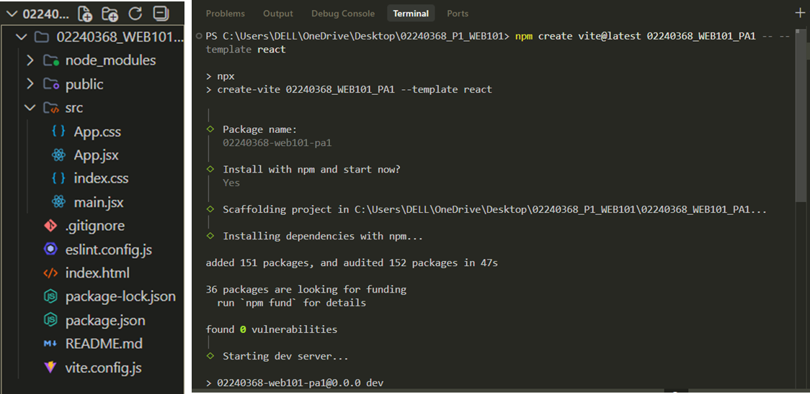
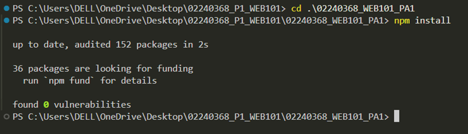

### The structure was organized as:
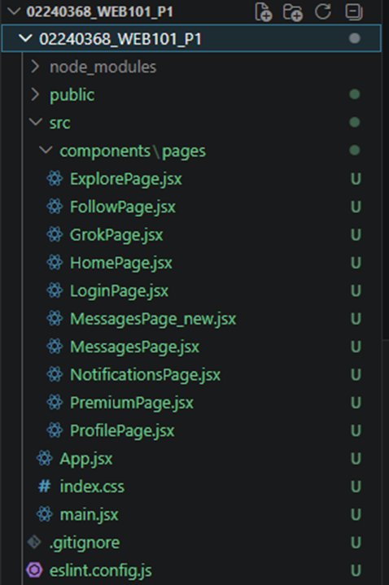
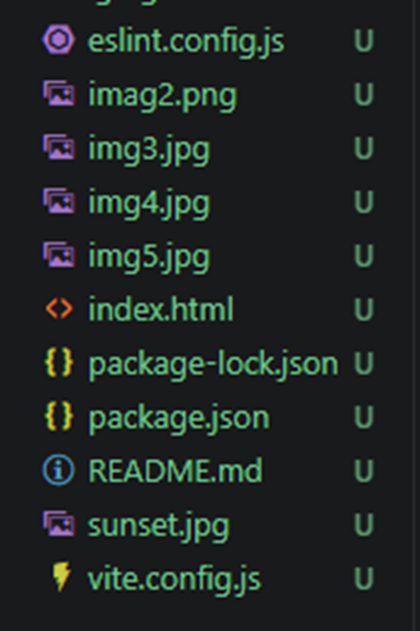

## Step 2: Component Structure Design
The Twitter (X) interface was analysed and broken down into its core reusable components.

### i.	App.jsx (Root Component) : main application component that manages global state including authentication status, active navigation, the tweet list, and modal visibility. It also handles the overall three column layout and moblie bottom navigation bar.

### ii.	LoginPage.jsx - is a standalone authentication component featuring controlled form inputs for email/username and password with a show/hide password toggle. It implements form validation, loading states, and Twitter-style UI design. Upon successful submission, it calls the onLogin prop callback with user data, which updates the global authentication state in App.jsx and navigates to the main application interface.

### iii. HomePage.jsx - the main feed page with navigation tabs ('For you'/'Following') and two main sub-components:
    TweetCard (displays individual tweets with author info, verification badges, engagement metrics, and interactive buttons that manage local like/retweet/bookmark states)

    The composer section (text area with user avatar, media buttons, character limit, and Post button for creating new tweets that get added to the top of the feed).

### iv.	MessagesPage.jsx - a two-panel messaging interface with conversation list (left panel featuring search, filters, refresh button, and unread badges) and chat window (right panel with user header, message area, and input field with Send button). Each conversation is rendered as a reusable ConversationItem component showing user avatar, name, handle, last message, and time with hover effects. Supports mobile responsive full-width chat view.

### v. ProfilePage.jsx Displays the logged-in user's profile including cover photo, avatar, bio, and a tabbed view for Posts, Replies, Media, and Likes sections.

### vi.	ExplorePage.jsx A search and trending page with a search bar and categorised trending topics.

### vii. GrokPage.jsx An AI chat interface styled after Twitter's Grok feature, with a message input and response display area.

### viii. PremiumPage.jsx Displays premium subscription tiers and features in a card layout.

### ix.	FollowPage.jsx Displays suggested accounts to follow with follow/unfollow toggle buttons.

## Step 3: Routing Implementation
Since this is a single-page application without a routing library, navigation was implemented using React's useState hook in App.jsx.
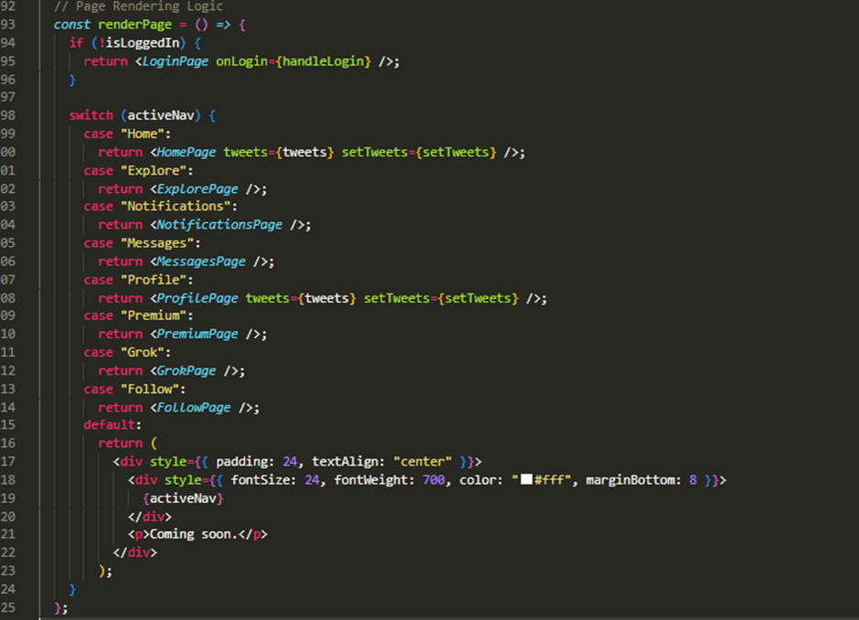

## Step 4: Responsive Design
Responsive behaviour was implemented across three breakpoints using CSS media queries injected via a <style> tag in App.jsx and through a custom useResponsive hook in HomePage.jsx.
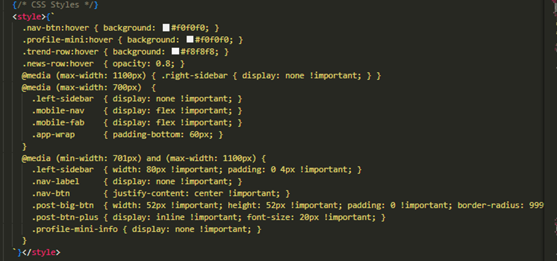
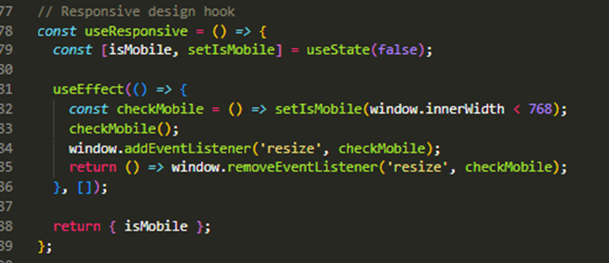

## Step 5: Interactive Features 
The following interactive features were implemented:
i.	Tweet Composition : the homepage composer allows users to type and post new tweets. The Post button is disabled until the user types at least one character. On enter, a new tweet object is prepended to the tweets array using the command;
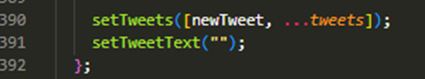

ii.	Like / Retweet / Bookmark : Each TweetCard manages its own toggle state for likes, retweets, and bookmarks. When toggled, the icons colour changes and the count updates by ±1 to reflect the user's action.

iii.	Login / Logout : LoginPage collects an email and password. If both are filled, the onLogin handler is called, setting isLoggedIn to true in App.jsx
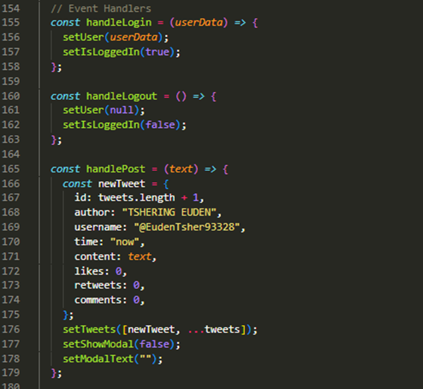

iv.	Post Modal : A modal overlay (accessible from both the sidebar Post button and the mobile FAB) allows posting from any page. It can be closed by clicking the backdrop or the × button.

v.	Mobile Drawer : On mobile, tapping the page title in the header opens a full sidebar drawer with all navigation items, the Post button, and the user profile.

## Challenges and Solutions
1.	After completing step 1 and running npm run dev the localhost showed 5173 instead of 3000. After some troubleshoot, the error was in vite.config.js
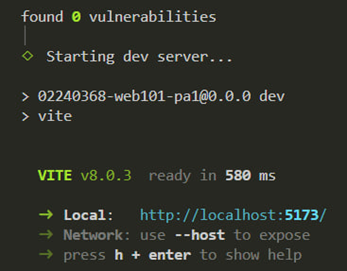 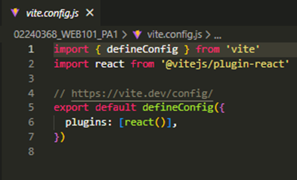

So, we added the server port to 3000. 
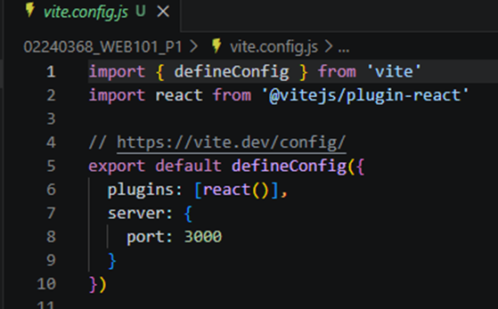 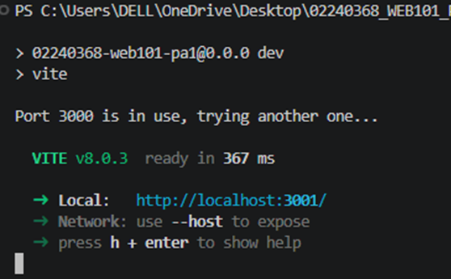

The Vite defaults to port 5173, so explicitly setting server: { port: 3000 } in vite.config.js overrides this behaviour.

2.	Responsive sidebar collapse on tablet as the sidebar needed to show icons only on tablet without duplicating th navigation code. It was solved using CSS classes (nav-label, post-big-btn) targeted inside a <style> block with a media query that hides labels and resizes the post button at 1100px. 

3.	Mobile navigation and drawer Twitter's mobile experience hides the sidebar and shows a bottom nav bar instead. This was implemented by tracking isMobile state using a useEffect listener on window.resize. The mobile sidebar drawer was built as a separate overlay component within App.jsx, toggled by the showMobileSidebar state.

# References
(2025). GeeksforGeeks. From https://www.geeksforgeeks.org/node-js/express-js/
Makau, L. (n.d.). Linkedln. From https://www.linkedin.com/pulse/understanding-distinction-rest-vs-restful-apis-lucky-makau/
(2026). Meta Platforms. From https://react.dev/learn
(n.d.). Mimo. From https://mimo.org/glossary/react/inline-styling
(n.d.). Mozilla Developer Network. From https://developer.mozilla.org/en-US/docs/Learn_web_development/Core/CSS_layout/Responsive_Design
(n.d.). Pluralsight. From https://www.pluralsight.com/resources/blog/guides/inline-styling-with-react
(n.d.). React Team. From https://react.dev/learn/passing-props-to-a-component
(n.d.). React Team. From https://react.dev/learn/state-a-components-memory
(n.d.). React Team. From https://react.dev/reference/react/useState
(n.d.). Vite. From https://vite.dev/guide/
(n.d.). W3Schools. From https://www.w3schools.com/nodejs/

