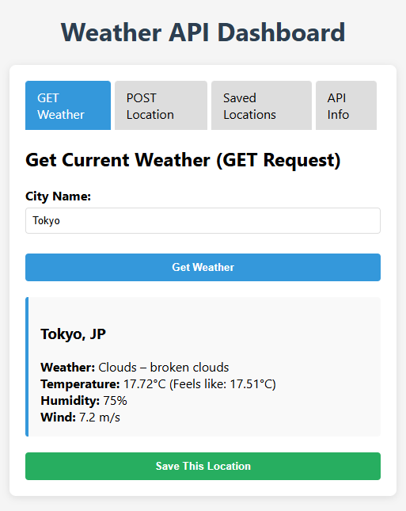
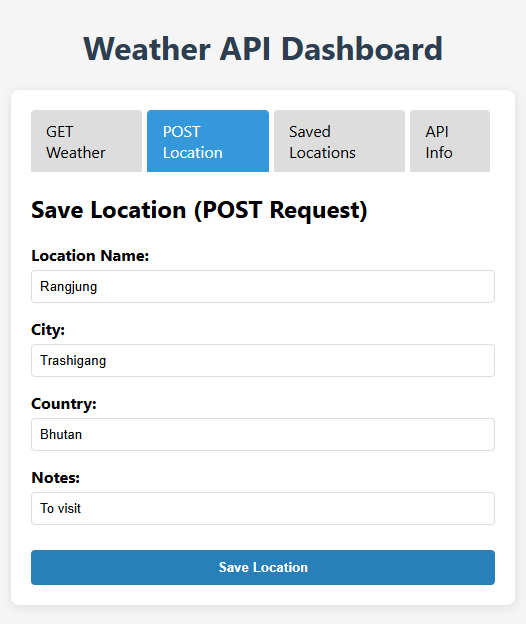
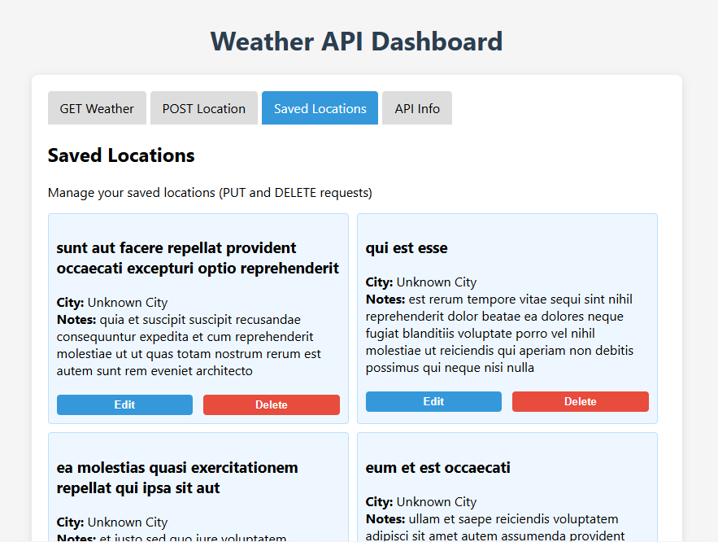
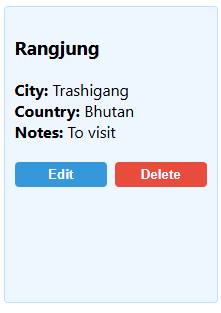
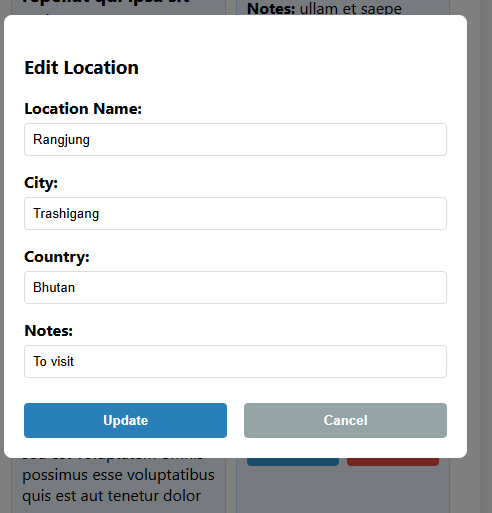
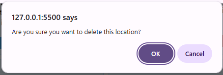
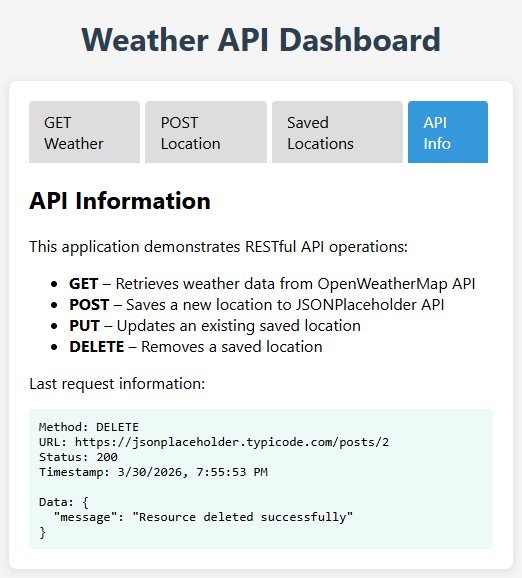
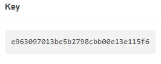

# Weather API Dashboard
- A RESTfull API web application demonstrating GET, POST, PUT, DELETE methods/ requests using OpenWeatherMap API and JSONPlaceholder API.

# Structure
- P2_RESTful_API_Weather_API/
  |___index.html
  |___script.js

# STEP 1- Get Your API Key
 1. Go to https://openweathermap.org/
 2. Sign up for a free account.
 3. After logging in, click your username → **My API Keys**
 4. Copy the default API key shown on the page and replace `YOUR_API_KEY` in `script.js` with your actual API key.

# STEP 2- Run the App
1. No server or installation required.

## How to use openweathermap.org
### 1:  
Go to **GET Weather** and type a city name in the input field (eg. Tokyo)
Weather data will appear below showing:
 - City and country
 - Weather
 - Temperature
 - Humidity
 - Wind Speed

### 2:  
Go to **POST** and click the **"POST"** button to create a new post and fill the information then click save location.

You will be automatically redirected to the **Saved Locations**.

### 3:  
Used to **edit or delete** your saved locations.
Click the **Edit** button on any location card.

**To Edit (PUT request):**
Update any field and click **Update** to save changes.

**To Delete (DELETE request):**
Click the **Delete** button on any location card and click ok to remove location from the list

### 4:  
Used to **view all saved locations**.
Shows **real-time request details** for the last API call made, including:

## Challenges Faced:
### Make sure you replaced `YOUR_OPENWEATHERMAP_API_KEY` in `script.js` with your actual API key from openweathermap.org

### After Signing Up, 10-30 minutes after singing up as new key takes time to activate.

