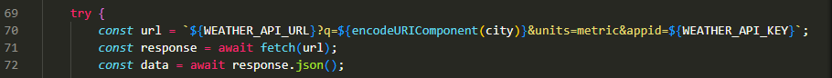
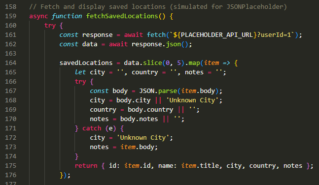
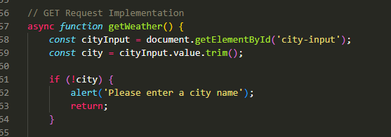
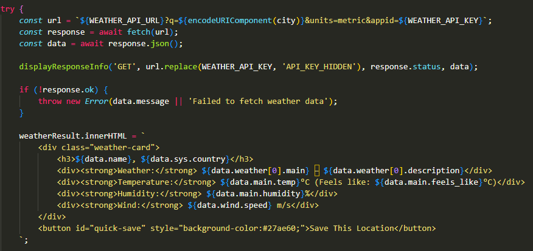
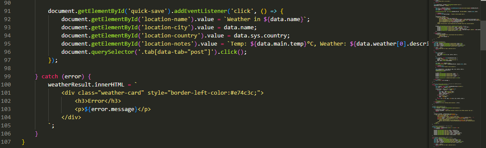

# RESTful API Weather Dashboard - Reflection
## a) Documentation — Main Concepts Applied
### RESTful API Architecture
This practical is built around the REST (Representational State Transfer) architecture.
REST uses standard HTTP methods to perform operations on data. The four core methods
demonstrated in this project are:
- GET: Retrieve data (e.g., fetching weather information)
- POST: Create new resources (e.g., adding a new city to the favorites list)
- PUT: Update existing resources (e.g., modifying a city's settings)
- DELETE: Remove resources (e.g., removing a city from favorites)

Each method maps to a CRUD operation:
- **GET** -> Read
- **POST** -> Create
- **PUT** -> Update
- **DELETE** -> Delete

### The Fetch API
The Fetch API is a modern JavaScript interface for making HTTP requests. It provides a cleaner, more powerful alternative to the older XMLHttpRequest (XHR) method.

### Async / Await
Async/await is a modern JavaScript syntax that makes working with promises easier and more readable. It allows you to write asynchronous code that looks and behaves like synchronous code.

### JSON (JavaScript Object Notation)
All API responses returned data in JSON format.
The project used:
- **response.json()** to parse the JSON response from the API.
- **JSON.parse()** to convert the JSON string into a JavaScript object.
- **JSON.stringify()** to convert a JavaScript object into a JSON string.    

### Error Handling with Try / Catch
Every API function was wrapped in a `try/catch` block to handle failed requests gracefully.

### DOM Manipulation
The project used various DOM manipulation methods to dynamically update the HTML content:
- **document.getElementById()** to select and modify specific elements.
- **innerHTML** to insert HTML content into elements.
- **textContent** to update text content.
- **addEventListener()** to handle user interactions (e.g., button clicks).
