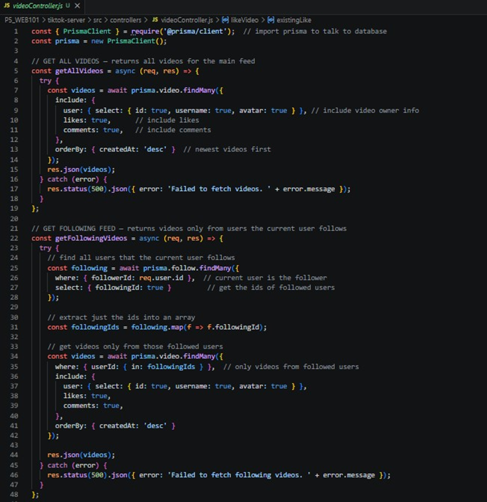
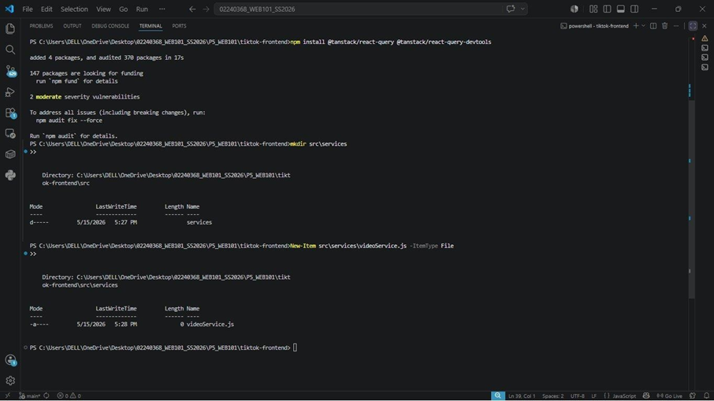
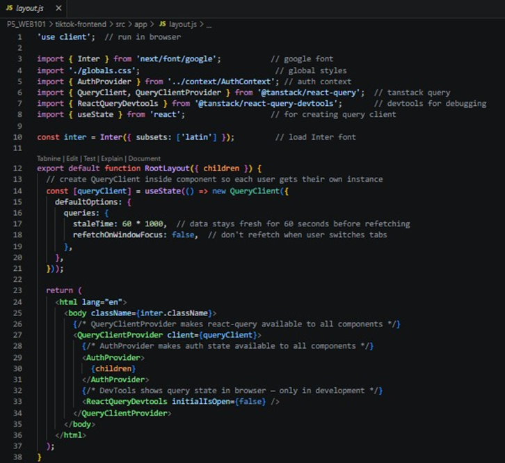
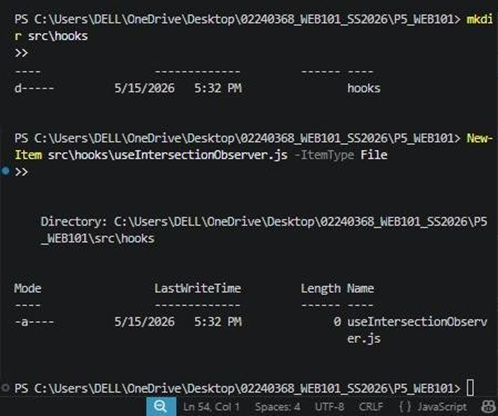
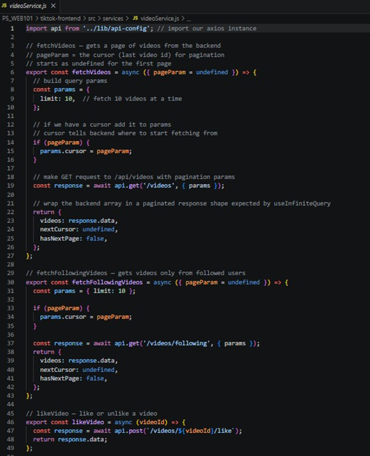
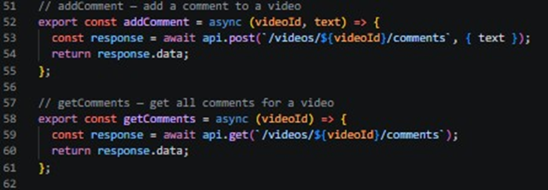
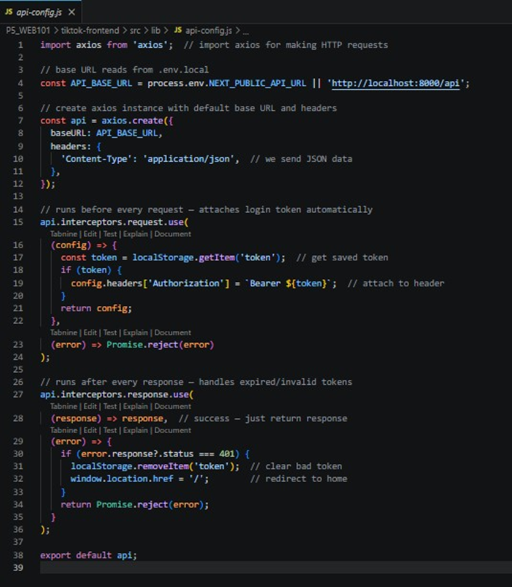
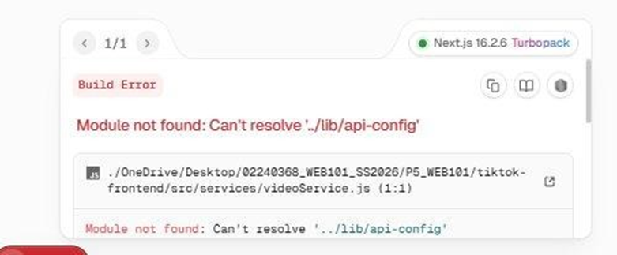
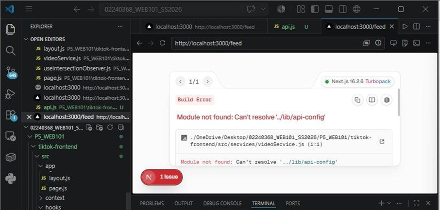
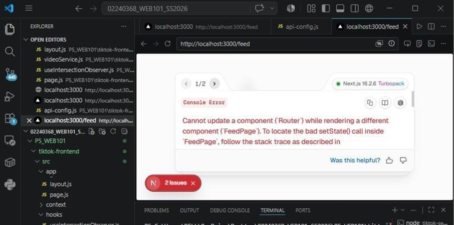

# WEB102 Practical 5 Report — Infinite Scrolling with TanStack Query

## Aim

Implement infinite scrolling in a TikTok clone using **TanStack Query (React Query)** with **cursor-based pagination**. This involves:
- Modifying the backend video controller to support cursor-based pagination.
- Updating the frontend to use the `useInfiniteQuery` hook combined with the **Intersection Observer API** for a smooth, endless scrolling experience.

## Theory

### Infinite Scrolling
New content loads automatically as the user scrolls down — no "next page" button needed. On TikTok, swiping up instantly loads the next video, continuing almost forever.

### Cursor-Based vs. Offset-Based Pagination
**Offset-Based** Uses `page` + `limit` (e.g. "page 3, 10 items"). Simple to implement; can show duplicates/skips when data changes.
**Cursor-Based** Uses a unique ID as a reference point (e.g. "10 items after ID 1234"). More efficient and consistent for large, dynamic datasets.

### TanStack Query (React Query)
A data-fetching and state management library for React. Its `useInfiniteQuery` hook:
- Automatically manages pagination state and cached pages.
- Provides `fetchNextPage()` to load more data.
- Exposes `hasNextPage` and `isFetchingNextPage` flags for UI control.
- Handles loading and error states automatically.

### Intersection Observer API
A browser API that efficiently detects when elements enter/exit the viewport. More performant than scroll event listeners — used here to trigger the next page fetch when the user reaches the bottom of the feed.

### Axios Interceptors
Middleware functions that run before every request or after every response:

- **Request interceptor** — automatically attaches the user's JWT token to every API call.
- **Response interceptor** — handles `401 Unauthorized` errors by clearing the stored token and redirecting to the home page.

## Implementation Steps
### Part 1: Update Backend (`tiktok-server`)
Updated `getAllVideos` and `getFollowingVideos` controllers to support cursor-based pagination.


### Part 2: Frontend Setup
#### Step 1 — Install TanStack Query and Create Service Files
Installed the required TanStack Query packages, then created:
- `src/services/` directory with `videoService.js`
- `src/hooks/` directory with `useIntersectionObserver.js`



#### Step 2 — Create `videoService.js` and `useIntersectionObserver.js`
- **`videoService.js`** — API functions for fetching videos with cursor-based pagination, liking videos, and managing comments.
- **`useIntersectionObserver.js`** — Custom hook to detect when the user reaches the bottom of the feed.




#### Step 3 — Create `src/lib/api-config.js`
A centralised Axios instance configured with:
- Base URL from `.env.local` (`NEXT_PUBLIC_API_URL`).
- **Request interceptor** — reads JWT from `localStorage` and attaches it to the `Authorization` header.
- **Response interceptor** — catches `401` responses, clears the token, and redirects to the home page.


## Challenges Faced
### 1. Module Not Found: `Can't resolve '../lib/api-config'`
**Cause:** `videoService.js` could not resolve the import because the file in `src/lib/` was named `api.js` instead of `api-config.js`.

**Fix:** Renamed the file to `api-config.js` in VS Code Explorer — resolved the build error.

### 2. Router Error and `video.user` Crash in `feed/page.js`
After the rename, two new errors appeared:
**Error 1 — Console Error:**
> "Cannot update a component ('Router') while rendering a different component ('FeedPage')"

**Cause:** `router.push()` was called directly inside the render function instead of inside a `useEffect`.
**Fix:** Moved `router.push('/login')` inside a `useEffect` with `[user, isLoading]` dependencies.

**Error 2 — TypeError:**
> `Cannot read properties of undefined (reading 'user')`

**Cause:** `video.user.username` was accessed without optional chaining, crashing when `video.user` was `null`.
**Fix:** Applied optional chaining throughout:

```js
// Before
video.user.username[0].toUpperCase()
@{video.user.username}

// After
video.user?.username?.[0]?.toUpperCase() ?? '?'
@{video.user?.username ?? 'unknown'}
```

## Conclusion

This practical demonstrated implementing infinite scrolling in a React/Next.js TikTok clone using TanStack Query and cursor-based pagination.
Key takeaways:
- **Cursor-based pagination** is more reliable than offset-based for dynamic feeds — avoids skipped or duplicated items when new content is added.
- **`useInfiniteQuery`** significantly simplified paginated state, loading flags, and data caching.
- **Intersection Observer API** provided a performant trigger mechanism without scroll event listeners.
- **React best practices reinforced:** navigation side effects belong in `useEffect`, and optional chaining should always be used when accessing nested API response properties that may be `null` or `undefined`.

## References
- *Cursor pagination: how it works and its pros and cons*. Retrieved May 16, 2026, from https://www.merge.dev/blog/cursor-pagination
- *Infinite Queries | TanStack Query React Docs*. Retrieved May 16, 2026, from https://tanstack.com/query/latest/docs/framework/react/guides/infinite-queries
- *Interceptors | Axios | Promise based HTTP client*. Retrieved May 16, 2026, from https://axios.rest/pages/advanced/interceptors
- *Intersection Observer API - Web APIs | MDN*. Retrieved May 16, 2026, from https://developer.mozilla.org/en-US/docs/Web/API/Intersection_Observer_API
- *Pagination in MySQL — PlanetScale*. Retrieved May 16, 2026, from https://planetscale.com/blog/mysql-pagination
- *What Is Infinite Scrolling and How Does It Work?* Retrieved May 16, 2026, from https://www.makeuseof.com/what-is-infinite-scrolling-and-how-does-it-work/
