# Todo List with Zustand
**WEB101 – Web Application Fundamentals (SS2026) | Practical 6**

## Aim
Build a Todo List application using React and Zustand for state management. This involved:

- Setting up a Vite + React project
- Creating a Zustand store with state and actions
- Building reusable components (`TodoInput`, `TodoItem`, `TodoList`)
- Adding persistence with Zustand middleware
- Applying a custom purple theme

## Theory
**Zustand** - A lightweight state management library for React. Requires no boilerplate or Provider wrappers. Uses a simple `create()` function to define a store with state and actions. 
**Vite** - A fast build tool and dev server using native ES modules with instant Hot Module Replacement (HMR). 
**React `useState`** - A React hook used inside `TodoInput` to track the local input field value before adding to the global store. 
**Zustand Persist Middleware** - Wraps the store and automatically saves state to `localStorage`, rehydrating it on page refresh. 
**Component-Based Architecture** - UI split across `TodoInput` (adding), `TodoItem` (displaying), `TodoList` (listing), and `App` (assembly + stats). 

## Implementation
### Step 1 – Project Setup
Create a new Vite + React project and install Zustand:
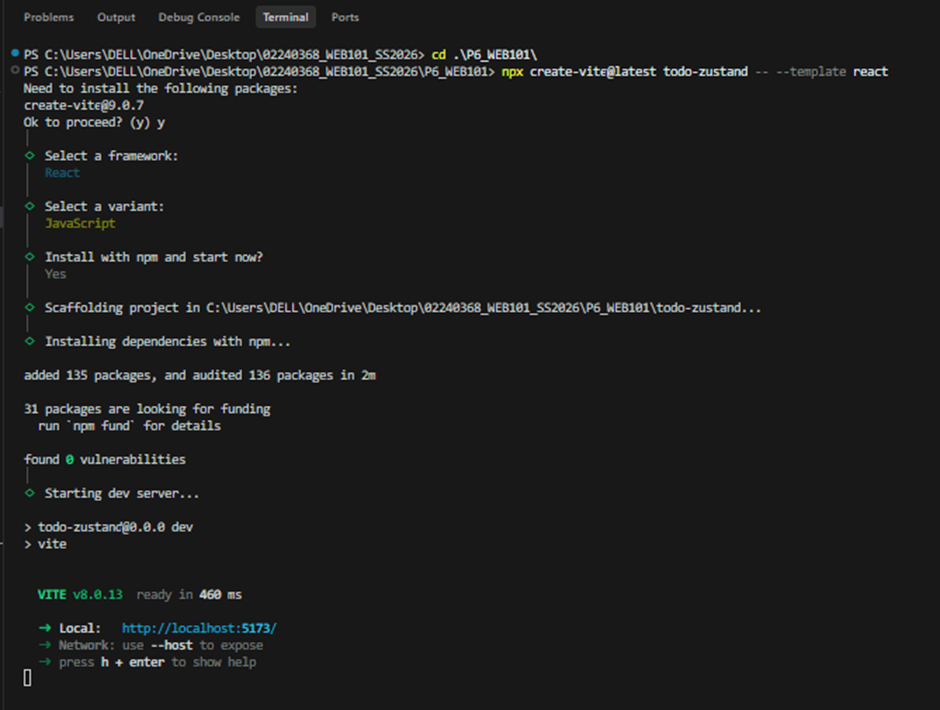

### Step 2 – Project Folder Structure
Create the `components` and `store` directories inside `src/`:
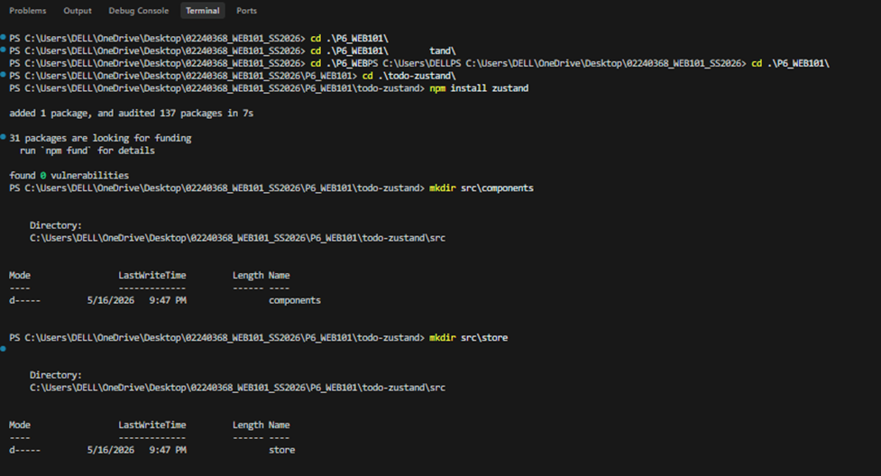
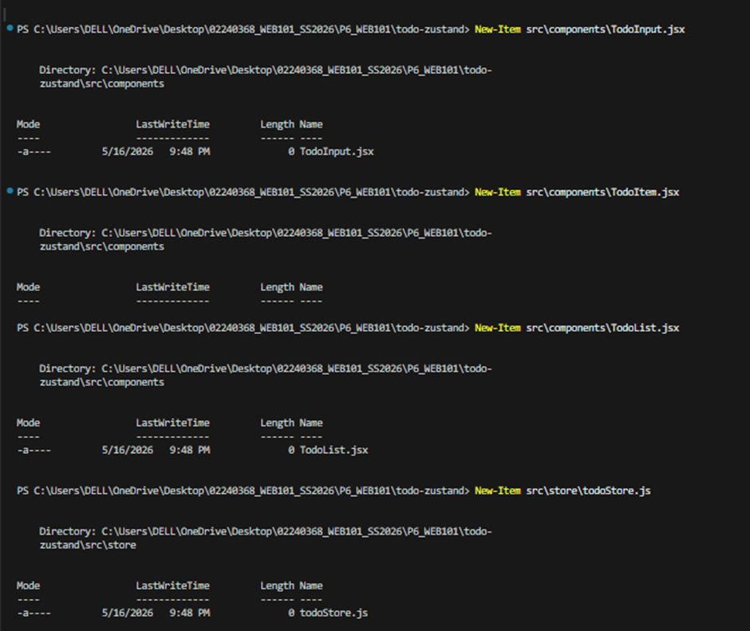

### Step 3 – Zustand Store (`src/store/todoStore.js`)
Central store holding a `todos` array and four actions: `addTodo`, `toggleTodo`, `removeTodo`, and `clearCompleted`. The `persist` middleware saves state to `localStorage` under the key `'todo-storage'`.
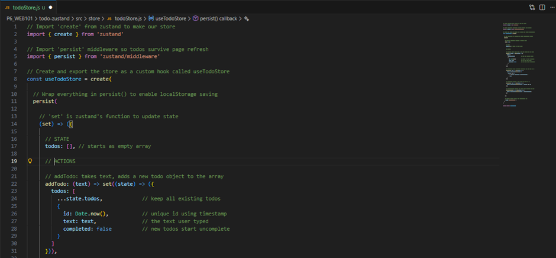
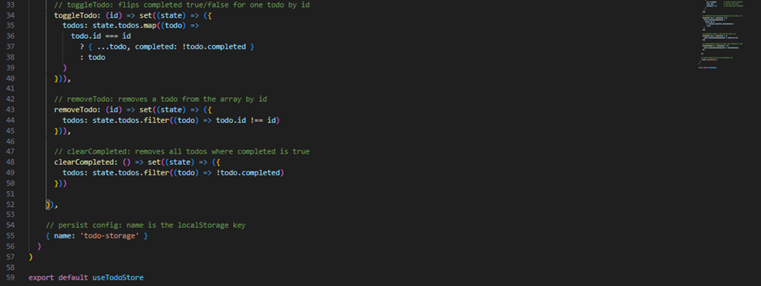

### Step 4 – TodoInput Component (`src/components/TodoInput.jsx`)
Uses `useState` to manage the local input value. Submitting via the **Add** button or pressing **Enter** calls `addTodo` and clears the input.
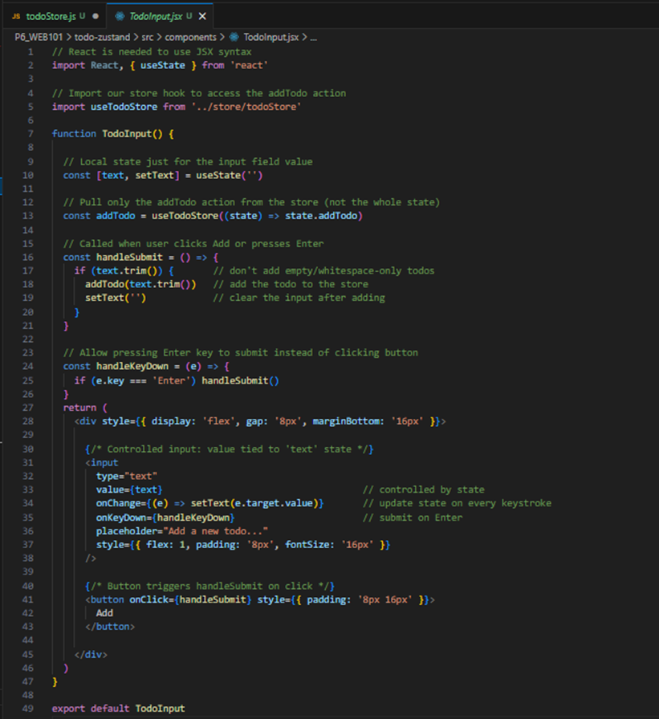

### Step 5 – TodoItem Component (`src/components/TodoItem.jsx`)
Displays a checkbox (toggle completion), todo text with strikethrough when done, and a **Delete** button.
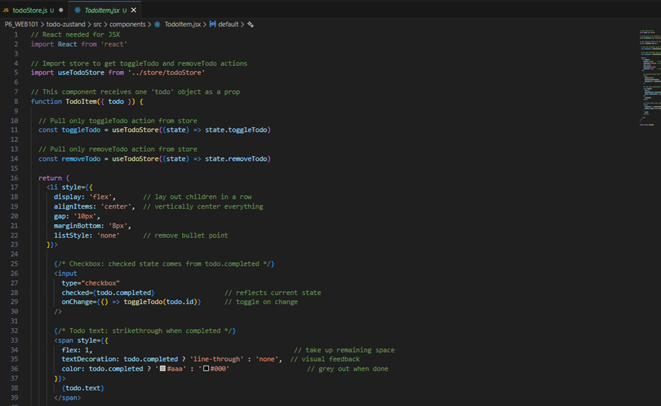
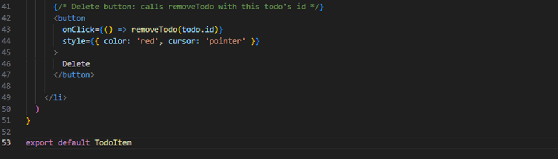

### Step 6 – TodoList Component (`src/components/TodoList.jsx`)
Reads the full `todos` array from the store and maps each item to a `TodoItem`. The **Clear Completed** button is shown only when at least one todo is complete.
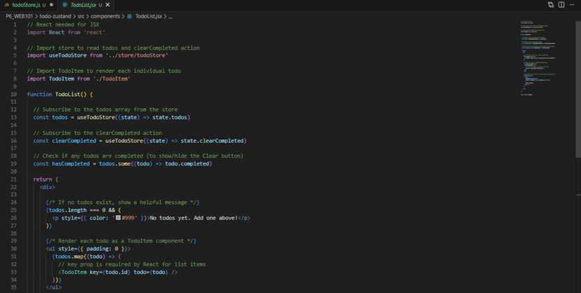
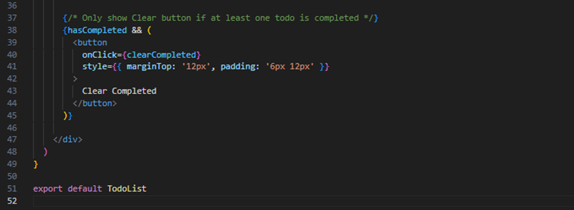

### Step 7 – App Component (`src/App.jsx`)
Assembles all components and displays live stats (total and completed counts) read directly from the Zustand store.
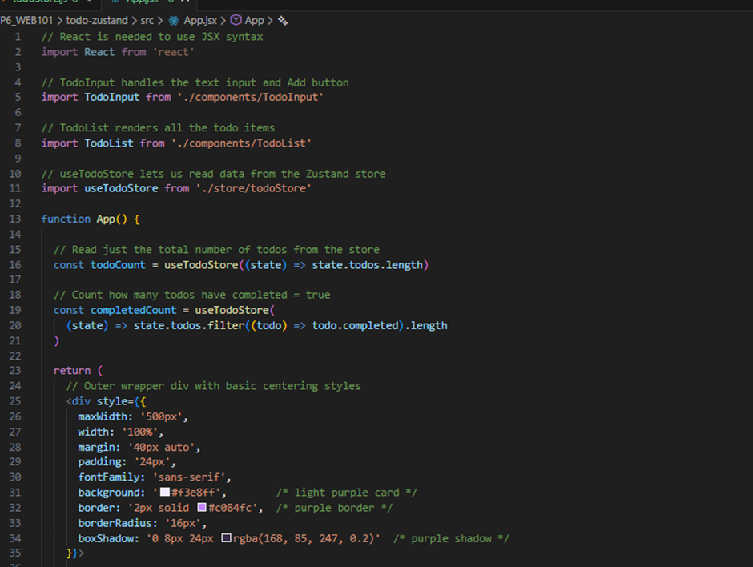
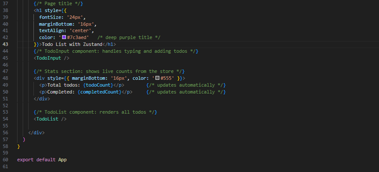

### Step 8 – Persistence Middleware

The `persist()` wrapper in `todoStore.js` (added in Step 3) automatically saves the `todos` array to `localStorage` on every state change and restores it on page load — no extra setup needed.
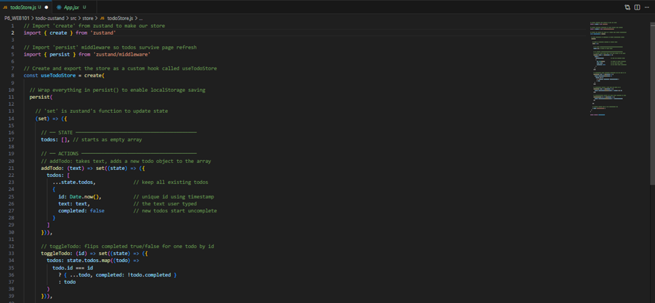
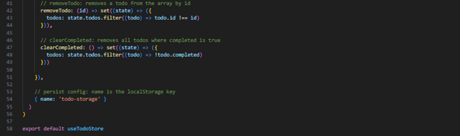

## Running the App
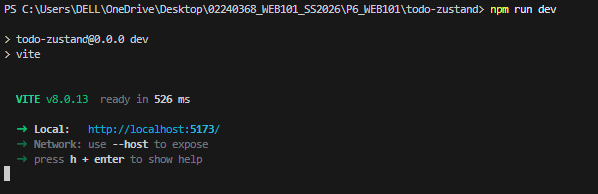

## Testing
- Add todos: Items appear in list; 
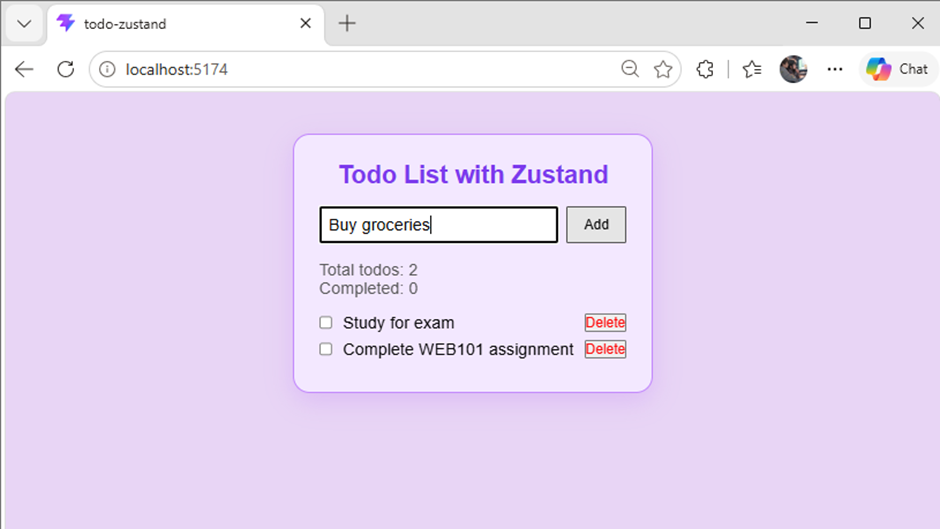

- Toggle completion: Checkbox marks item with strikethrough; Completed counter updates
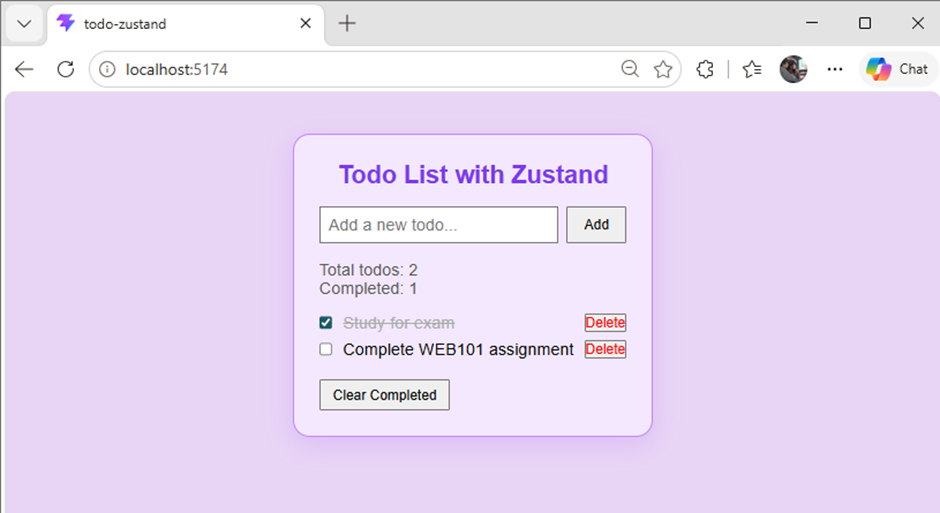

- Delete a todo: Item removed; Total counter decrements
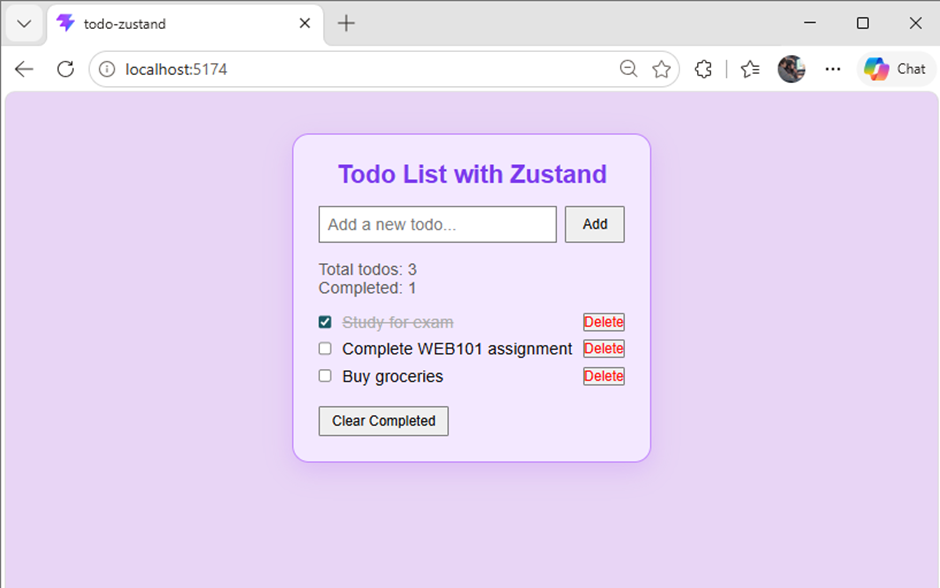

- Clear Completed: All completed todos removed at once
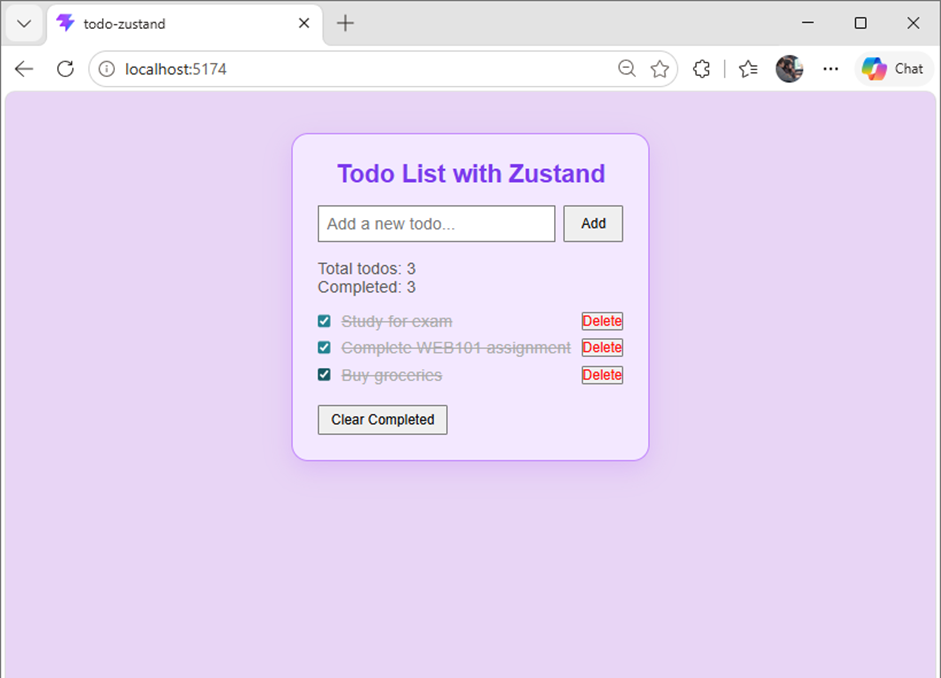

- Persistence (refresh): All todos survive browser page refresh
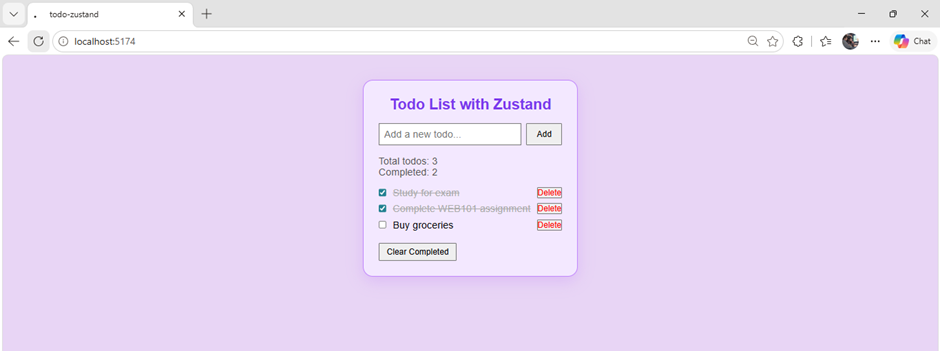
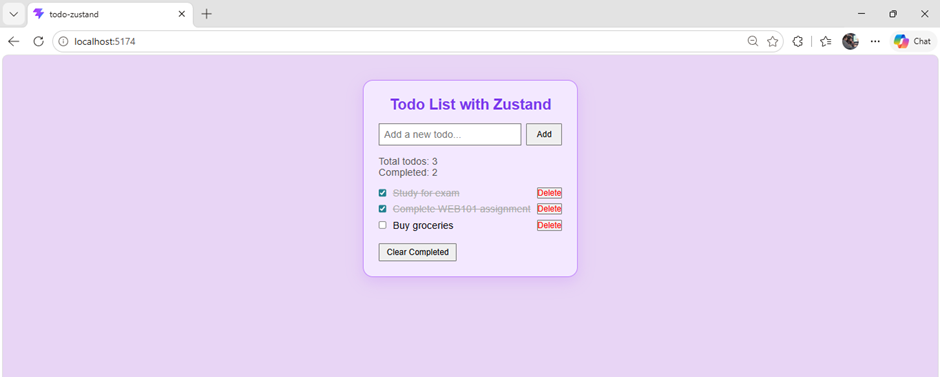

## Conclusion
This practical demonstrated how Zustand simplifies global state management in React. A central store with clearly defined actions allowed state to be shared across components without prop drilling or complex Context setups. The `persist` middleware added `localStorage` persistence with minimal code. The project reinforced core React concepts — component composition, controlled inputs, and conditional rendering — while introducing Zustand as a lightweight, production-ready alternative to Redux.

## References
- Zustand Documentation: https://zustand.site/en/docs/
- Zustand Persist Middleware: https://zustand.site/en/docs/persist/
- Thinking in React: https://react.dev/learn/thinking-in-react
- React `useState`: https://react.dev/reference/react/useState
- Vite Guide: https://vite.dev/guide/
