# WEB101 — Web Application Fundamentals (SS2026)
## Lab 7 Report

## Aim

The aim of this practical was to implement various charting libraries to create an analytics dashboard using React. This involved setting up Recharts for a monthly sales line chart and a product category pie chart, and react-chartjs-2 with Chart.js for a customer acquisition stacked bar chart and a weekly visitors area chart, all driven by real sales data from a shared data file.

## Theory

### Recharts
Recharts is a composable charting library built on React components and D3. It provides ready-made chart components such as LineChart and PieChart that accept data directly as props. ResponsiveContainer wraps any chart to make it resize fluidly with its parent element. Tooltip and Legend are plug-in components that add hover information and color keys automatically without extra configuration (Recharts/Recharts: Redefined Chart Library Built with React and D3, n.d.).

### Chart.js and react-chartjs-2
Chart.js is a popular JavaScript charting library that renders charts onto an HTML5 Canvas (Chart.Js | Chart.Js, n.d.). react-chartjs-2 is a thin React wrapper that exposes Bar, Line, and other components (React-Chartjs-2, n.d.). Because Chart.js uses a tree-shakeable architecture, all modules used (scales, elements, plugins) must be explicitly registered with ChartJS.register() before rendering any chart.

### React useState and useEffect
useState manages local component state such as the chartData object expected by Chart.js (UseState – React, n.d.). useEffect runs side effects after render; with an empty dependency array it runs once on mount, making it the correct place to transform raw imported data into the {labels, datasets} format required by Chart.js without causing repeated re-renders (UseEffect – React, n.d.).

### date-fns
date-fns is a lightweight JavaScript date utility library. The format() and parseISO() functions were used together to convert ISO date strings such as '2023-01-01' into human-readable axis labels such as 'Jan 2023' for the Customer Acquisition bar chart (Date-Fns - Modern JavaScript Date Utility Library, n.d.).

### Filler Plugin (Area Charts)
Chart.js includes a Filler plugin that fills the area beneath a line dataset when fill: true is set on that dataset. It must be explicitly imported and registered alongside the other Chart.js modules. Without registering Filler, the fill property has no effect and the chart renders as a plain line (Area Chart | Chart.Js, n.d.).

## Implementation Steps

### Step 1: Clone Repository and Install Dependencies
Cloned the starter repository from GitHub, navigated into the project directory, ran the base npm install, then installed the four additional charting libraries needed for the practical.
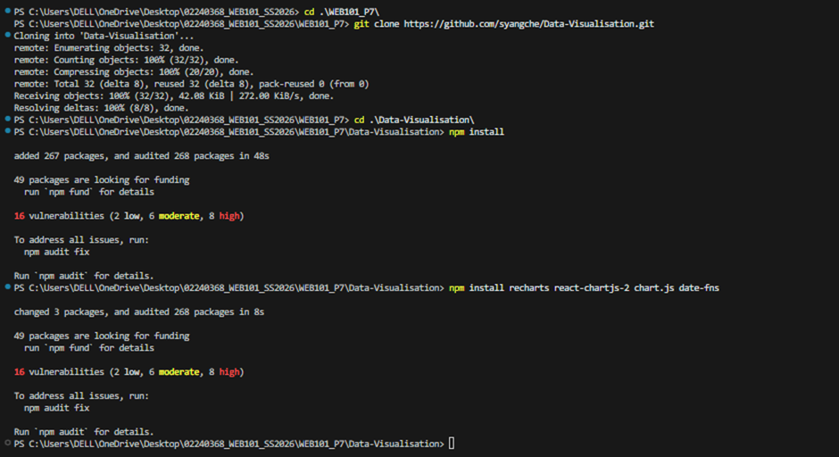

### Step 2: Create Monthly Sales Chart (Line Chart - Recharts)
Created `src/components/MonthlySalesChart.jsx`. The component wraps a Recharts LineChart in a ResponsiveContainer so it fills its parent div. Three Line components read the sales, profit, and target keys from monthlySales. The Target line uses strokeDasharray to appear dashed. The Tooltip formatter prepends a dollar sign to hovered values.
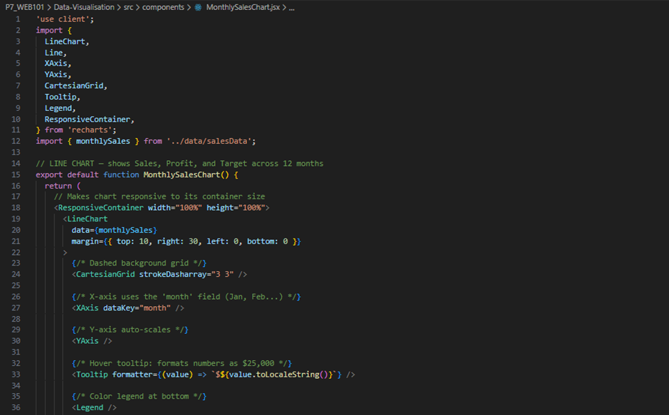
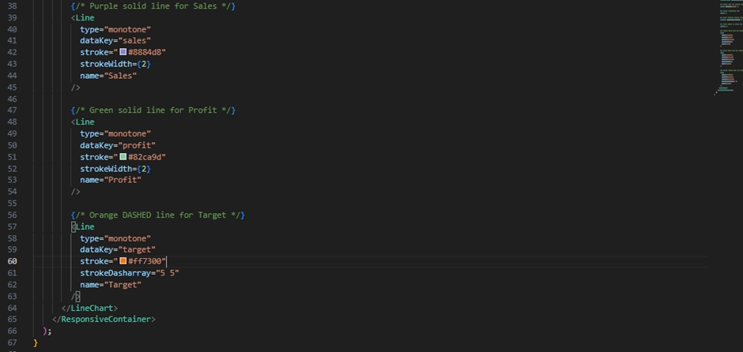

### Step 3: Create Product Category Chart (Pie Chart - Recharts)
Created `src/components/ProductCategoryChart.jsx`. A Pie component inside PieChart maps each entry in productSales to a Cell, each given a color from the COLORS array using modulo to cycle colors. The label prop renders the category name and percentage directly on each slice. labelLine is set to false to keep the chart clean.
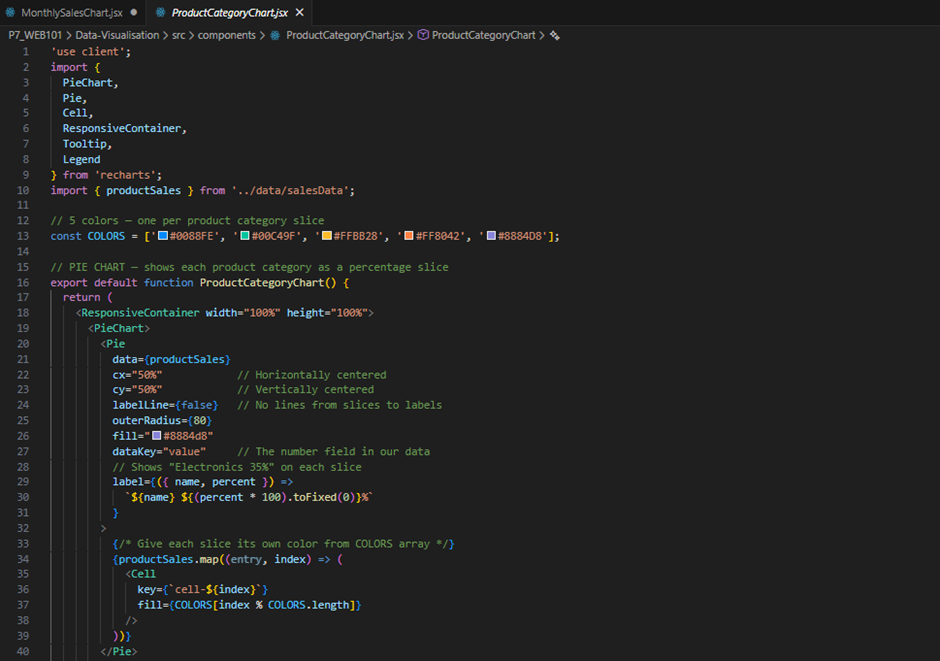
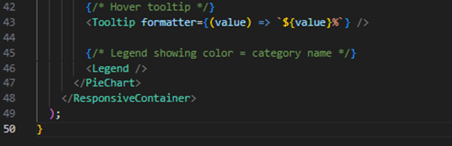

### Step 4: Create Customer Acquisition Chart (Bar Chart - react-chartjs-2)
Created `src/components/CustomerAcquisitionChart.jsx`. Required Chart.js modules are registered once at module level. A useEffect hook on mount transforms customerData into the {labels, datasets} object expected by Chart.js. date-fns format() converts the ISO date strings to 'MMM yyyy' labels. The stacked: true option on both axes stacks new and returning customer bars on top of each other.
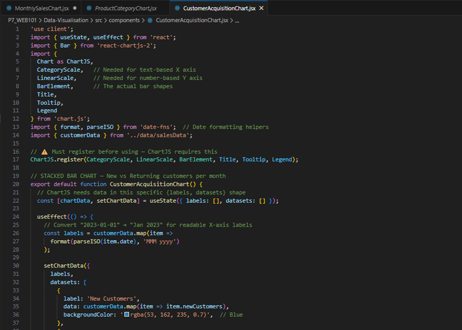
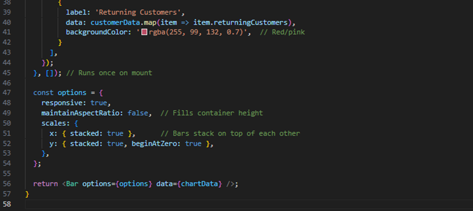

### Step 5: Create Weekly Visitors Chart (Area Chart - react-chartjs-2)
Created `src/components/WeeklyVisitorsChart.jsx`. The Filler plugin is imported and registered alongside the other Chart.js modules so that fill: true on the dataset produces a colored area under the line. Week labels are generated as 'Week 1' through 'Week 52'. tension: 0.4 gives the line a smooth curve. beginAtZero: false lets the Y axis start near the actual data range rather than forcing it to zero.
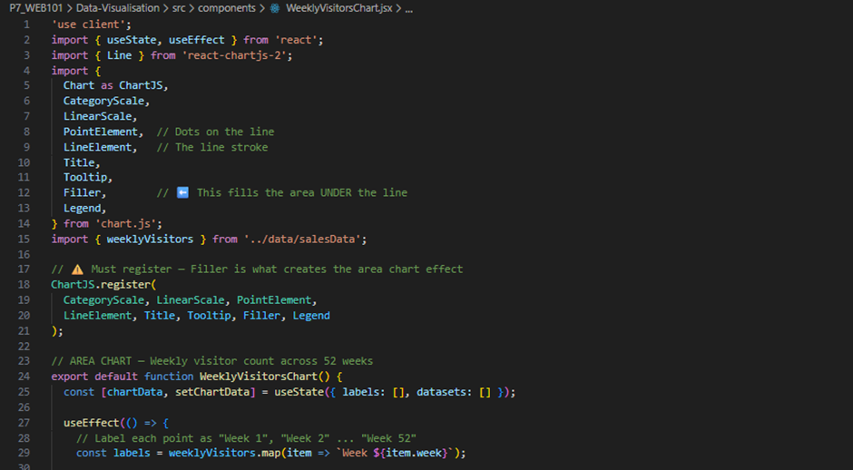
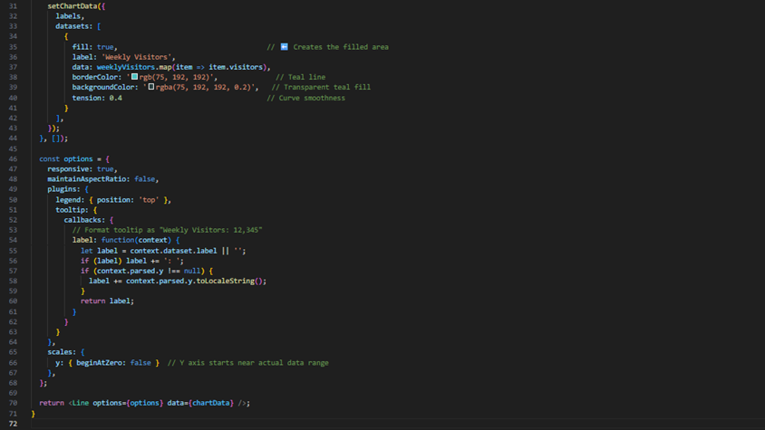

### Step 6: Update App.jsx
Updated `src/App.jsx` to import all four chart components and arrange them inside a two-column grid. Each chart sits inside a card section with a heading and a chartContainer div that provides a fixed height for the chart to fill.
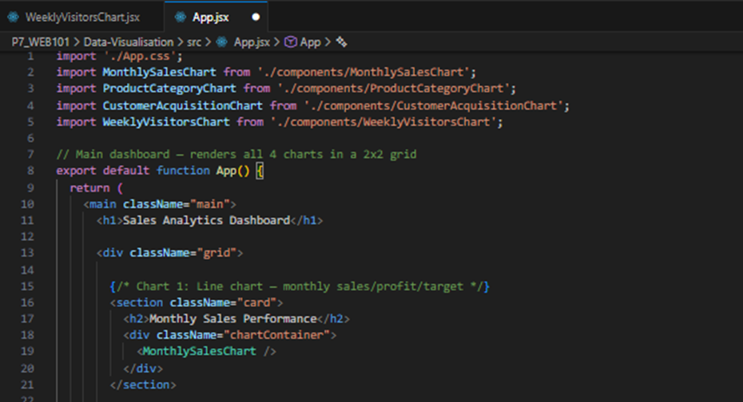
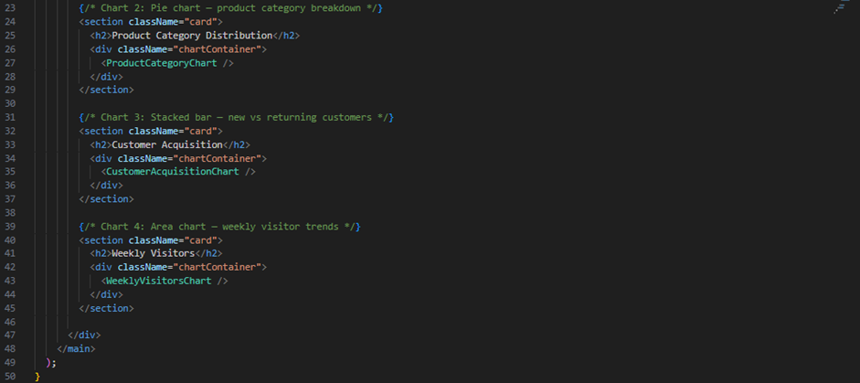

### Step 7: Run the Development Server
Started the Vite development server with `npm run dev`. The terminal confirmed the server was ready in 275 ms and serving at http://localhost:5173. The browser was opened to verify all four charts rendered correctly.
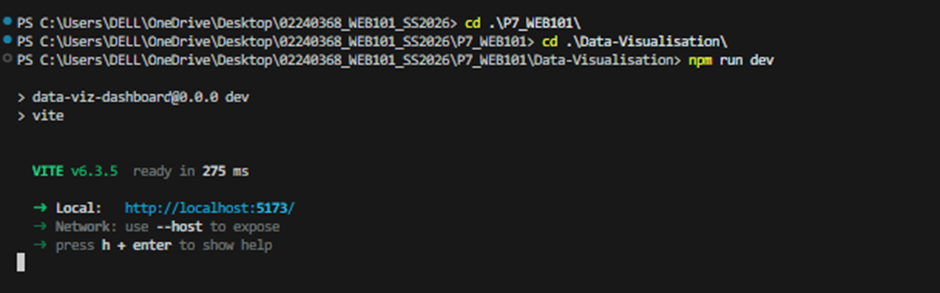

## Output

### Browser:

**Monthly Sales Performance and Product Category Distribution**
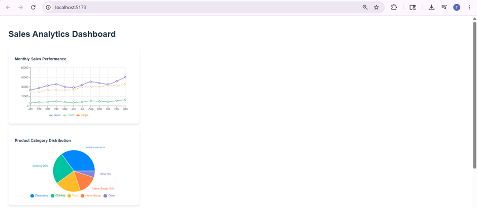

**Customer Acquisition and Weekly Visitors**
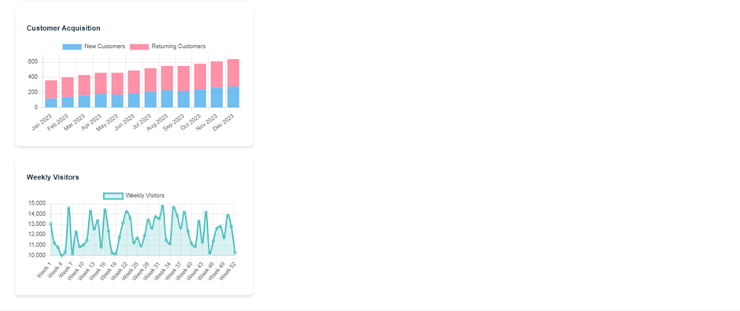

## Conclusion
This practical successfully implemented a four-chart Sales Analytics Dashboard in React. Recharts was used for its declarative component model to build the Monthly Sales line chart and the Product Category pie chart, while react-chartjs-2 wrapping Chart.js was used to build the stacked Customer Acquisition bar chart and the filled Weekly Visitors area chart. Key skills practiced included registering Chart.js modules explicitly, using useEffect to transform raw imported data into the {labels, datasets} format on mount, formatting dates with date-fns, making Recharts charts responsive with ResponsiveContainer, and enabling area fills with the Chart.js Filler plugin. All four charts rendered correctly with interactive tooltips and legends in the browser.

## Reference
- Area Chart | Chart.js. (n.d.). Retrieved May 17, 2026, from https://www.chartjs.org/docs/latest/charts/area.html
- Chart.js | Chart.js. (n.d.). Retrieved May 17, 2026, from https://www.chartjs.org/docs/latest/
- date-fns - modern JavaScript date utility library. (n.d.). Retrieved May 17, 2026, from https://date-fns.org/docs/Getting-Started#introduction
- react-chartjs-2. (n.d.). Retrieved May 17, 2026, from https://react-chartjs-2.js.org/
- recharts/recharts: Redefined chart library built with React and D3. (n.d.). Retrieved May 17, 2026, from https://github.com/recharts/recharts
- useEffect – React. (n.d.). Retrieved May 17, 2026, from https://react.dev/reference/react/useEffect
- useState – React. (n.d.). Retrieved May 17, 2026, from https://react.dev/reference/react/useState
