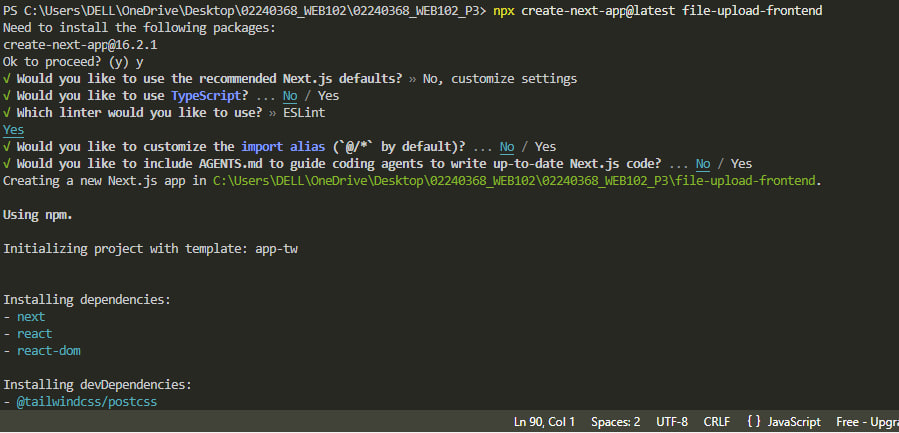
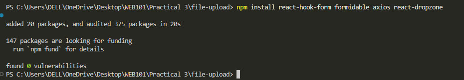
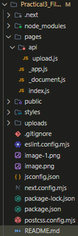
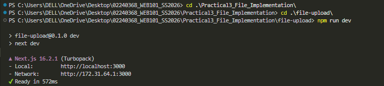
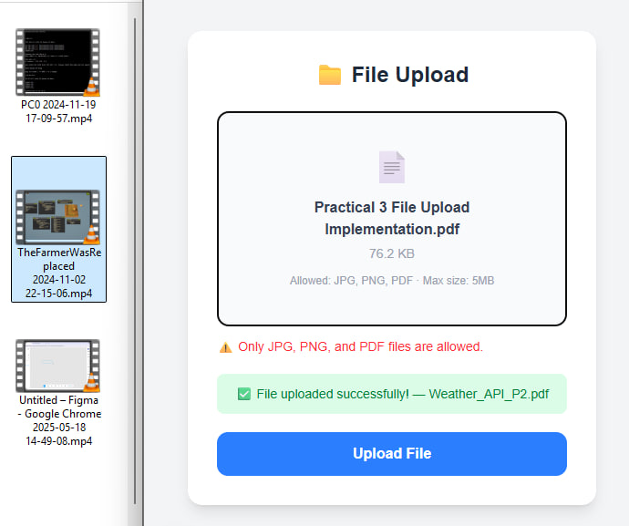
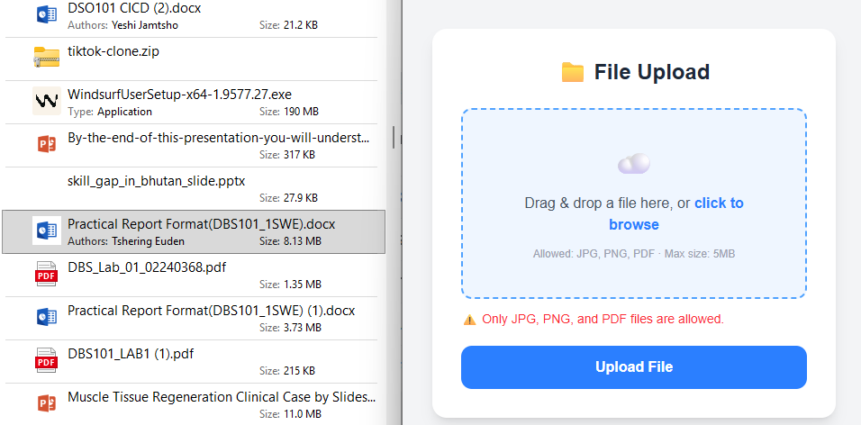
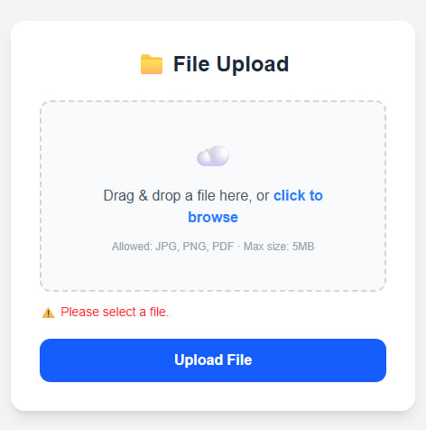
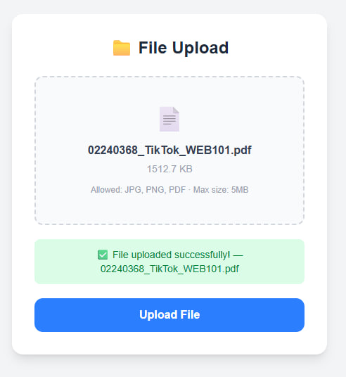
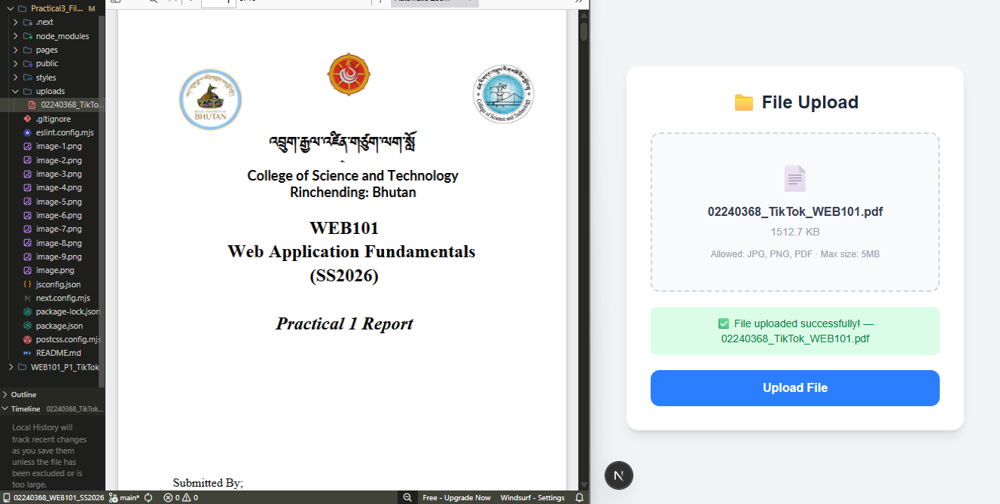

# Practical 3 - File Upload Implementation

## Objective
Create a React application with a file upload form that includes:
- Multipart form data handling
- File type and size validation
- Upload progress tracking
- Drag and drop interface

### Step 1 - Create Next.js Project

Select the following options:
- TypeScript → No
- ESLint → Yes
- Tailwind CSS → Yes
- src/ directory → No
- App Router → No
- Import aliases → No
- AGENTS.md → No

### Step 2 - Install Dependencies

## Folder Structure

## Implementation
### API Route (pages/api/upload.js)
Handles file uploads on the server side:
- Disables Next.js body parser so Formidable can parse the file.
- Automatically creates an uploads/ folder if it does not exist.
- Accepts files up to 5MB.
- Returns file name, size, and type on success.

### Upload Form (pages/index.js)
The main frontend form with four features:

**1.File Validation**
Only accepts JPG, PNG, and PDF files under 5MB.
Any other file type or size shows an error message immediately.

**2.Drag and Drop**
Users can drag a file onto the dropzone or click to browse.
The dropzone highlights in blue when a file is dragged over it.

**3.Progress Tracking**
A blue progress bar fills in real time during upload.
Uses Axios onUploadProgress callback to calculate percentage.

**4.Success/Error Feedback**
Green message on successful upload.
Red message if upload fails.

## Running the Practical
To run the practical, follow these steps:
1. Navigate to the project directory.
2. Run the development server using `npm run dev`.
3. Open your browser and navigate to `http://localhost:3000`.

## Testing
**Drag a JPG/PNG/PDF onto the box, file name and size appear.**

**Try uploading a non-image file (e.g., .mp4) -> Error message appears.**

**Try uploading a file larger than 5MB -> Error message appears.**

**Click Upload with no file -> Please select a file.**

**Upload a valid file -> Green success message.**

**Check uploads/ folder -> File saved inside.**

## Troubleshooting
**Issue: Default Next.js page still showing after pasting code.**
**Press Ctrl+S to save index.js and the browser will automatically reload.**
**Same for api/upload.js**
