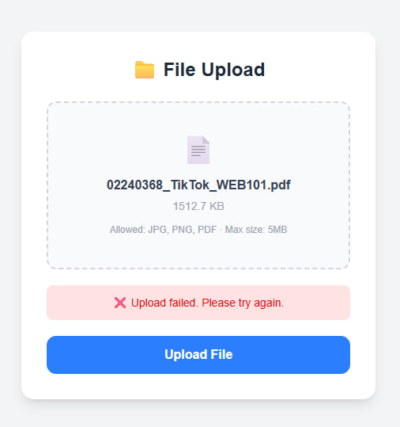

# Reflection - Practical 3: File Upload Implementation.

## a) Documentation.

### Main Concepts Applied.
**Next.js API Routes**
Next.js allows both frontend and backend code to live in the same project. The pages/api/ folder contains serverless API endpoints. The upload route was created at pages/api/upload.js to handle incoming file requests on the server side.

**Multipart Form Data**
When uploading a file, the browser uses multipart/form-data encoding to pack the file into the HTTP request. Next.js cannot parse this format by default, so the built-in body parser was disabled and Formidable was used instead to extract the file from the request.

**File Validation**
Before sending the file to the server, a validateFile() function checks two rules 
- the file must be JPG, PNG, or PDF. 
- must be under 5MB. 
React Hook Form was used to display validation error messages to the user.

**Upload Progress Tracking**
Axios was used instead of fetch because it provides an onUploadProgress callback. This gives the number of bytes sent and the total file size, which is used to calculate a percentage and update a progress bar in real time.

**Drag and Drop Interface**
React Dropzone was used to implement drag and drop file selection. The useDropzone() hook attaches drag and drop behaviour to the dropzone container. The box highlights in blue when a file is dragged over it using Tailwind CSS conditional classes.

**Tailwind CSS**
Tailwind CSS utility classes were used for all styling instead of inline JavaScript style objects. This kept the JSX cleaner and easier to read.

## b) Reflection.

### What I Learned.
This practical taught me how file uploads work from both the 
frontend and backend perspective. I learned that files cannot 
be sent as regular JSON and require multipart/form-data encoding, 
and that the server needs a special parser like Formidable to 
handle them.

I also learned the difference between fetch and Axios:
- Axios provides upload progress events which are not available in fetch, making it the better choice for tracking upload progress.

Using React Dropzone showed me how third-party libraries can add complex interactions like drag and drop with very little code. React Hook Form made managing form validation errors much cleaner compared to handling them manually with useState.

Using Tailwind CSS throughout the project also improved my understanding of utility-first styling and how conditional classes can be used to create interactive visual feedback.

### Challenges Faced and solutions.
**PowerShell Command Error**
When trying to create a new file using echo. in the terminal, PowerShell returned a CommandNotFoundException. I learned thatecho. is a Windows CMD command and does not work in PowerShell. The correct command is New-Item pages\index.js.

**Upload Failed Error**
The first upload attempt failed even though a valid file was selected. I found that upload.js had unsaved changes. Saving the file with Ctrl+S reloaded the server route and subsequent uploads succeeded.

### Summary
Overall this practical gave me the understanding of how file uploads work in a full stack Next.js application. The challenges I faced, mostly around unsaved files which taught me to be more careful and methodical when working in VS Code. I now feel confident implementing file upload features in future web projects.

### References
- Next.js. (n.d.). API Routes. From https://nextjs.org/docs/pages/building-your-application/routing/api-routes
- Formidable. (n.d.). Formidable documentation. From https://github.com/node-formidable/formidable
- MDN Web Docs. (n.d.). POST method. From https://developer.mozilla.org/en-US/docs/Web/HTTP/Methods/POST
- React Hook Form. (n.d.). useForm. From https://react-hook-form.com/docs/useform
- Axios. (n.d.). Request config. From https://axios-http.com/docs/req_config
- React Dropzone. (n.d.). React Dropzone documentation. From https://react-dropzone.js.org/
- Tailwind CSS. (n.d.). Utility-first fundamentals. From https://tailwindcss.com/docs/utility-first
